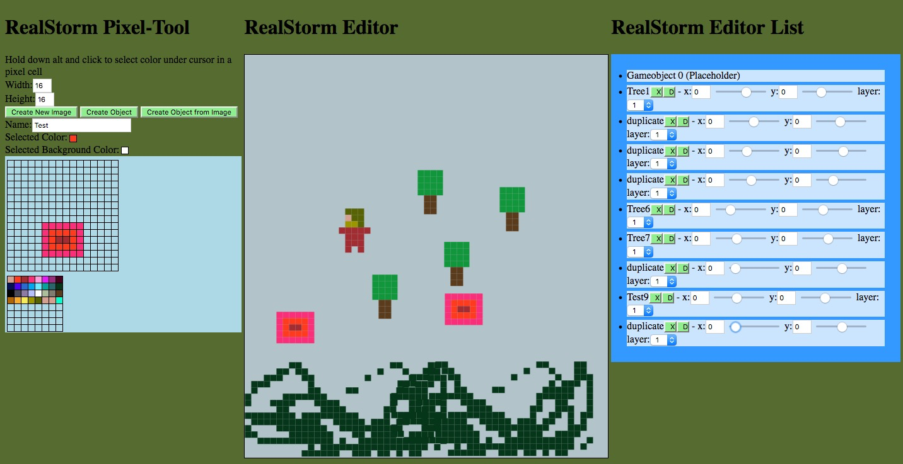

# RealStorm-GameEngine-Web
A GameEngine for 2D Games with integrated Pixel Art Editor
## Screenshot:

Currently only working in Firefox!  - 
Steps to start:
1. Draw Player Object - Click Create Object from Image
2. Draw Projectile (usually a single dot) - Click Create Object from Image 
3. Click set script
4. Controll the player with left and right arrow, up arrow(jumping) and down array(fire).